Opendata and datawarehouse … a COVID19 machine learning tale
================
TF
2022-03-25

-   [1 Objective](#objective)
-   [2 Abbreviations](#abbreviations)
-   [3 Results - descriptive graph](#results---descriptive-graph)
-   [4 Results - Analysis of the best
    model](#results---analysis-of-the-best-model)
    -   [4.1 Plot prediction in delay
        style](#plot-prediction-in-delay-style)
    -   [4.2 Plot predictions in movie
        style](#plot-predictions-in-movie-style)
    -   [4.3 EDS vs no EDS](#eds-vs-no-eds)
-   [5 Results Bootstrap](#results-bootstrap)
    -   [5.1 Graph Bootstrap and EHR vs no
        EHR](#graph-bootstrap-and-ehr-vs-no-ehr)
    -   [5.2 Graph vaccine vs no vaccine
        data](#graph-vaccine-vs-no-vaccine-data)
    -   [5.3 Features importance](#features-importance)

# 1 Objective

Sketch results section for article submission.

# 2 Abbreviations

-   MAE : median absolute error
-   MRE : median relative error

# 3 Results - descriptive graph

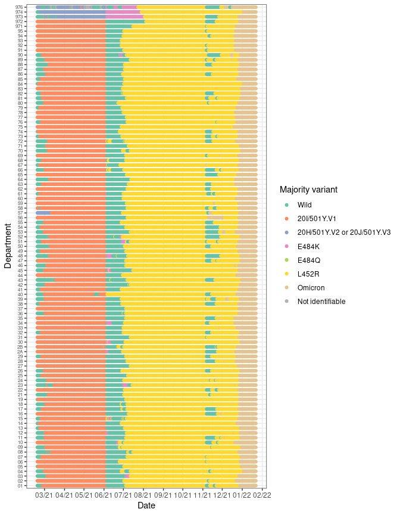

Figure 3.1: Majority variant evolution by department.

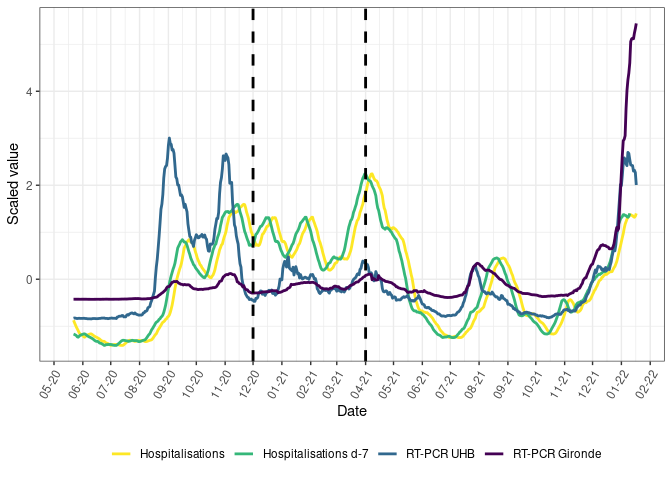

Figure 3.2: PCR and hospitalisations at CHU de Bordeaux. Simple moving
average 7 days. Dotted line represents the maximum of hospitalisations
of April peak.

During the period from 2020-05-16 to 2022-01-17, 3451 hospitalization
due to COVID19 were recorded

| t.mean | precip | RH.mean | AH.mean | IPTCC.mean | ws.mean | dewpoint.mean |
|-------:|-------:|--------:|--------:|-----------:|--------:|--------------:|
|      4 |      4 |       4 |       4 |          4 |       4 |             4 |

Table 3.1: Max number of consecutive days for LOCF imputation

# 4 Results - Analysis of the best model

Goal of second part of results is to show the predictions of the model
using :

-   source = CHU only (+ Gironde data)
-   features = Open data + datawarehouse
-   smoothing span = 21 days
-   model = linear regression with elastic-net

We compute features importance and forecast predictions specifically
regarding forecast delay.

## 4.1 Plot prediction in delay style

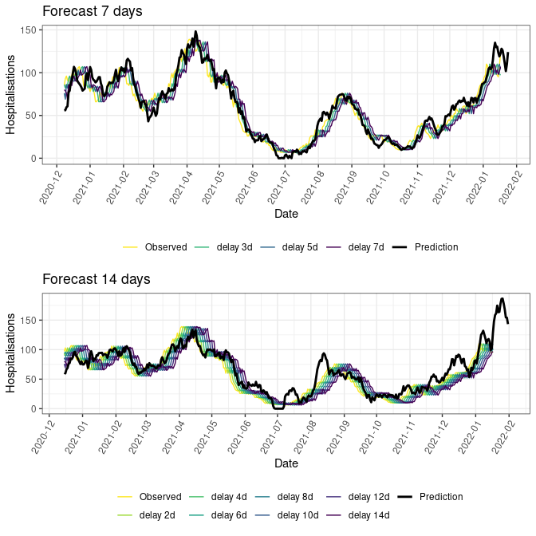

Figure 4.1: Prediction delay according to forecast and Date

Conclusion

-   Delay around 4 days for a 7 days forecast
-   Delay aroung 6 days for a 14 days forecast

## 4.2 Plot predictions in movie style

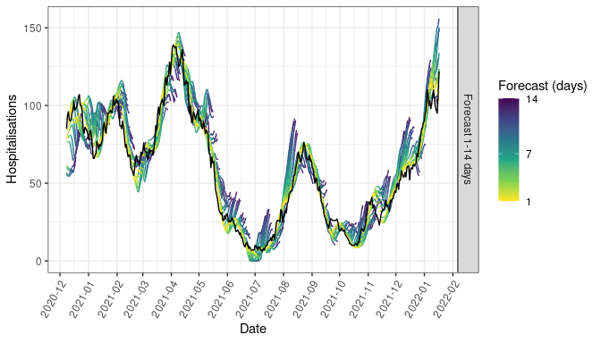

Figure 4.2: Hospitalisation forecast each day according to different
forecast time.

Conclusion

-   Predictions are good from january to june, then they largely over
    estimating number of hospitalisations suggesting a vaccine effect.
-   The april decrease is too much anticipated
-   The intra-hospital cluster of december leads to wrong predictions

## 4.3 EDS vs no EDS

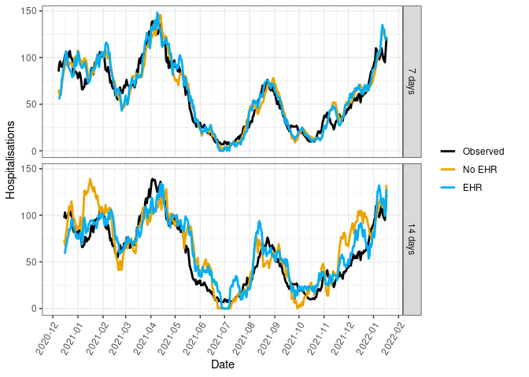

Figure 4.3: Forecast depending on the use of EHR data

# 5 Results Bootstrap

| forecast | df     | step                                                                                                                                       | AE\_median              | RE\_median              |
|---------:|:-------|:-------------------------------------------------------------------------------------------------------------------------------------------|:------------------------|:------------------------|
|        7 | dfOpen | Hosp + RT-PCR                                                                                                                              | 9.18 \[8.84 ; 9.59\]    | 0.214 \[0.209 ; 0.220\] |
|        7 | dfOpen | Hosp + RT-PCR + Weather                                                                                                                    | 8.86 \[8.60 ; 9.18\]    | 0.209 \[0.204 ; 0.214\] |
|        7 | dfOpen | Hosp + RT-PCR + Weather + Variants + Vaccine                                                                                               | 9.39 \[9.03 ; 9.83\]    | 0.216 \[0.210 ; 0.220\] |
|        7 | dfEDS  | Hosp + RT-PCR                                                                                                                              | 8.94 \[8.48 ; 9.31\]    | 0.176 \[0.169 ; 0.185\] |
|        7 | dfEDS  | Hosp + RT-PCR + Weather                                                                                                                    | 7.80 \[7.41 ; 8.19\]    | 0.161 \[0.154 ; 0.170\] |
|        7 | dfEDS  | Hosp + RT-PCR + Weather + Variants + Vaccine                                                                                               | 8.06 \[7.63 ; 8.48\]    | 0.172 \[0.163 ; 0.181\] |
|        7 | dfEDS  | Hosp + RT-R + Gironde Hosp + Gironde RT-PCR                                                                                                | 8.73 \[8.34 ; 9.16\]    | 0.173 \[0.165 ; 0.181\] |
|        7 | dfEDS  | Hosp + RT-R + Gironde Hosp + Gironde RT-PCR + Weather                                                                                      | 7.53 \[7.17 ; 7.92\]    | 0.155 \[0.149 ; 0.164\] |
|        7 | dfEDS  | Hosp + RT-R + Gironde Hosp + Gironde RT-PCR + Weather + CT-scan + emergency units + ambulance service                                      | 6.43 \[6.05 ; 6.81\]    | 0.137 \[0.127 ; 0.148\] |
|        7 | dfEDS  | Hosp + RT-R + Gironde Hosp + Gironde RT-PCR + Weather + CT-scan + emergency units + ambulance service + Variants + Vaccine                 | 6.41 \[6.07 ; 6.81\]    | 0.138 \[0.128 ; 0.146\] |
|        7 | dfEDS  | Hosp + RT-R + Gironde Hosp + Gironde RT-PCR + Weather + CT-scan + emergency units + ambulance service + Variants + Vaccine + Variant x PCR | 6.50 \[6.14 ; 6.91\]    | 0.138 \[0.128 ; 0.147\] |
|        7 | dfEDS  | Hosp + RT-R + Gironde Hosp + Gironde RT-PCR + Weather + CT-scan + emergency units + ambulance service + Variants + Vaccine + Vaccine x PCR | 6.18 \[5.80 ; 6.61\]    | 0.130 \[0.121 ; 0.140\] |
|       11 | dfEDS  | Hosp + RT-R + Gironde Hosp + Gironde RT-PCR + Weather + CT-scan + emergency units + ambulance service + Variants + Vaccine                 | 8.93 \[8.38 ; 9.37\]    | 0.191 \[0.178 ; 0.205\] |
|       14 | dfOpen | Hosp + RT-PCR                                                                                                                              | 14.99 \[14.53 ; 15.45\] | 0.309 \[0.300 ; 0.319\] |
|       14 | dfOpen | Hosp + RT-PCR + Weather                                                                                                                    | 13.49 \[13.03 ; 13.97\] | 0.263 \[0.255 ; 0.273\] |
|       14 | dfOpen | Hosp + RT-PCR + Weather + Variants + Vaccine                                                                                               | 17.36 \[16.85 ; 18.00\] | 0.367 \[0.354 ; 0.382\] |
|       14 | dfEDS  | Hosp + RT-PCR                                                                                                                              | 15.99 \[15.08 ; 16.98\] | 0.332 \[0.318 ; 0.343\] |
|       14 | dfEDS  | Hosp + RT-PCR + Weather                                                                                                                    | 11.91 \[11.33 ; 12.51\] | 0.249 \[0.237 ; 0.261\] |
|       14 | dfEDS  | Hosp + RT-PCR + Weather + Variants + Vaccine                                                                                               | 13.19 \[12.47 ; 13.83\] | 0.267 \[0.253 ; 0.282\] |
|       14 | dfEDS  | Hosp + RT-R + Gironde Hosp + Gironde RT-PCR                                                                                                | 17.23 \[16.30 ; 18.29\] | 0.321 \[0.305 ; 0.337\] |
|       14 | dfEDS  | Hosp + RT-R + Gironde Hosp + Gironde RT-PCR + Weather                                                                                      | 11.83 \[11.16 ; 12.50\] | 0.240 \[0.229 ; 0.253\] |
|       14 | dfEDS  | Hosp + RT-R + Gironde Hosp + Gironde RT-PCR + Weather + CT-scan + emergency units + ambulance service                                      | 10.09 \[9.50 ; 10.65\]  | 0.207 \[0.194 ; 0.221\] |
|       14 | dfEDS  | Hosp + RT-R + Gironde Hosp + Gironde RT-PCR + Weather + CT-scan + emergency units + ambulance service + Variants + Vaccine                 | 10.11 \[9.54 ; 10.65\]  | 0.207 \[0.194 ; 0.221\] |
|       14 | dfEDS  | Hosp + RT-R + Gironde Hosp + Gironde RT-PCR + Weather + CT-scan + emergency units + ambulance service + Variants + Vaccine + Variant x PCR | 10.80 \[10.14 ; 11.43\] | 0.231 \[0.216 ; 0.244\] |
|       14 | dfEDS  | Hosp + RT-R + Gironde Hosp + Gironde RT-PCR + Weather + CT-scan + emergency units + ambulance service + Variants + Vaccine + Vaccine x PCR | 10.55 \[10.00 ; 11.27\] | 0.217 \[0.201 ; 0.233\] |
|       18 | dfEDS  | Hosp + RT-R + Gironde Hosp + Gironde RT-PCR + Weather + CT-scan + emergency units + ambulance service + Variants + Vaccine                 | 12.14 \[11.46 ; 12.83\] | 0.236 \[0.222 ; 0.253\] |

Table 5.1: Median absolute and relative error of model predictions of
Sars-Cov-2 pandemic with 95% confidence intervals. Data source
evaluation.

| forecast | rolderiv | span | model   | AE\_median              | RE\_median              |
|---------:|:---------|-----:|:--------|:------------------------|:------------------------|
|        7 | TRUE     |    0 | enet    | 8.28 \[7.76 ; 8.80\]    | 0.170 \[0.158 ; 0.181\] |
|        7 | TRUE     |    7 | enet    | 8.07 \[7.60 ; 8.64\]    | 0.166 \[0.154 ; 0.178\] |
|        7 | TRUE     |   14 | enet    | 7.08 \[6.67 ; 7.53\]    | 0.158 \[0.148 ; 0.171\] |
|        7 | TRUE     |   21 | enet    | 6.41 \[6.07 ; 6.81\]    | 0.138 \[0.128 ; 0.146\] |
|        7 | FALSE    |   21 | enet    | 8.15 \[7.53 ; 8.83\]    | 0.164 \[0.151 ; 0.179\] |
|        7 | FALSE    |   21 | frechet | 7.94 \[7.40 ; 8.39\]    | 0.179 \[0.167 ; 0.191\] |
|        7 | TRUE     |   21 | poisson | 12.08 \[11.22 ; 12.87\] | 0.273 \[0.258 ; 0.286\] |
|        7 | TRUE     |   21 | rf      | 8.00 \[8.00 ; 9.00\]    | 0.178 \[0.167 ; 0.189\] |
|       14 | TRUE     |    0 | enet    | 11.83 \[11.23 ; 12.61\] | 0.249 \[0.233 ; 0.264\] |
|       14 | TRUE     |    7 | enet    | 12.62 \[11.99 ; 13.41\] | 0.260 \[0.245 ; 0.276\] |
|       14 | TRUE     |   14 | enet    | 10.82 \[10.14 ; 11.50\] | 0.220 \[0.205 ; 0.235\] |
|       14 | TRUE     |   21 | enet    | 10.11 \[9.54 ; 10.65\]  | 0.207 \[0.194 ; 0.221\] |
|       14 | FALSE    |   21 | enet    | 13.02 \[12.00 ; 14.12\] | 0.303 \[0.278 ; 0.328\] |
|       14 | FALSE    |   21 | frechet | 13.07 \[12.30 ; 13.80\] | 0.246 \[0.233 ; 0.259\] |
|       14 | TRUE     |   21 | poisson | 15.81 \[14.74 ; 16.82\] | 0.367 \[0.347 ; 0.390\] |
|       14 | TRUE     |   21 | rf      | 14.00 \[13.00 ; 15.00\] | 0.276 \[0.264 ; 0.288\] |

Table 5.2: Median absolute and relative error of model predictions of
Sars-Cov-2 pandemic with 95% confidence intervals. Statistical
algorithm.

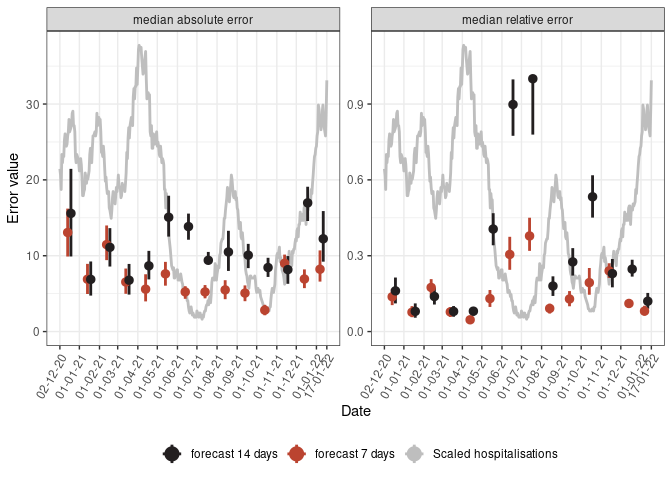

Figure 5.1: Evolution of median absolute and relative errors by month.

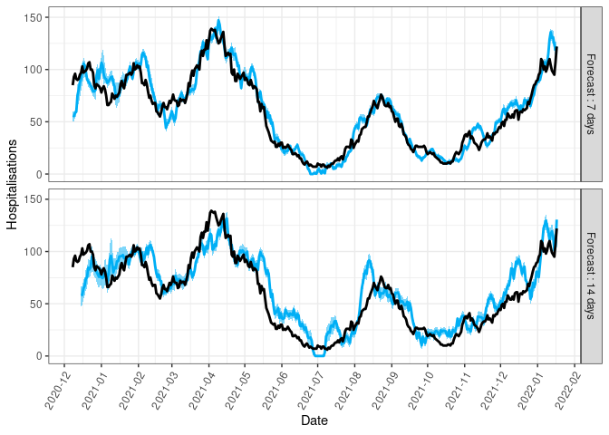

Figure 5.2: Bootstrapped prediction intervals.

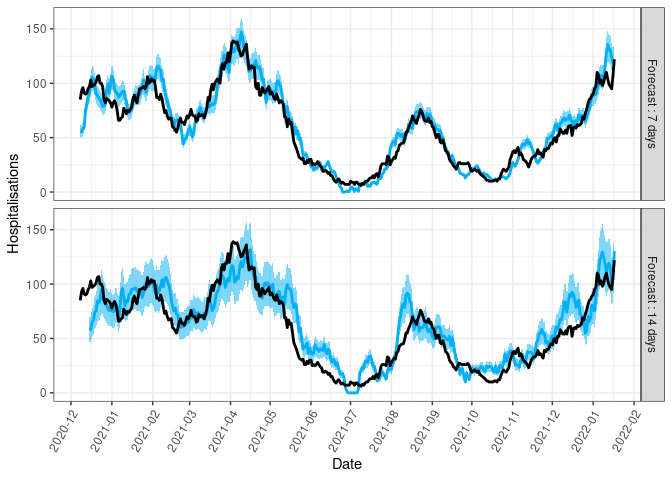

Figure 5.3: Predictions with 10% prediction intervals at 7 days and 20%
at 14 days.

| Forecast day | Period                     | Bootstrap | Handmade |
|-------------:|:---------------------------|----------:|---------:|
|            7 | \[2020-12-01 ; 2021-01-01) |     0.226 |    0.323 |
|            7 | \[2021-01-01 ; 2021-03-01) |     0.339 |    0.508 |
|            7 | \[2021-03-01 ; 2021-05-01) |     0.492 |    0.721 |
|            7 | \[2021-05-01 ; 2021-07-01) |     0.246 |    0.180 |
|            7 | \[2021-07-01 ; 2021-09-01) |     0.339 |    0.419 |
|            7 | \[2021-09-01 ; 2021-11-01) |     0.377 |    0.393 |
|            7 | \[2021-11-01 ; 2022-01-11) |     0.169 |    0.394 |
|           14 | \[2020-12-01 ; 2021-01-01) |     0.548 |    0.677 |
|           14 | \[2021-01-01 ; 2021-03-01) |     0.508 |    0.831 |
|           14 | \[2021-03-01 ; 2021-05-01) |     0.328 |    0.803 |
|           14 | \[2021-05-01 ; 2021-07-01) |     0.049 |    0.016 |
|           14 | \[2021-07-01 ; 2021-09-01) |     0.226 |    0.435 |
|           14 | \[2021-09-01 ; 2021-11-01) |     0.246 |    0.311 |
|           14 | \[2021-11-01 ; 2022-01-11) |     0.172 |    0.594 |

Table 5.3: 95% prediction interval coverage by bootstrap and handmade
20-40% rule. Results by time period.

| Forecast day | Bootstrap | Handmade |
|-------------:|----------:|---------:|
|            7 |     0.315 |    0.426 |
|           14 |     0.276 |    0.511 |

Table 5.4: 95% prediction interval coverage by bootstrap and handmade
20-40% rule

## 5.1 Graph Bootstrap and EHR vs no EHR

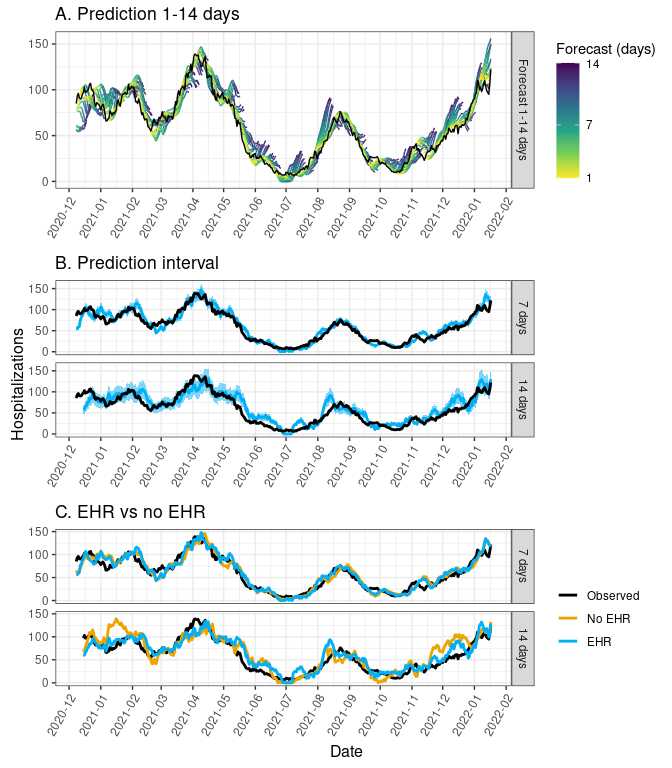

Figure 5.4: Prediction intervals and comparions EHR vs no EHR

## 5.2 Graph vaccine vs no vaccine data

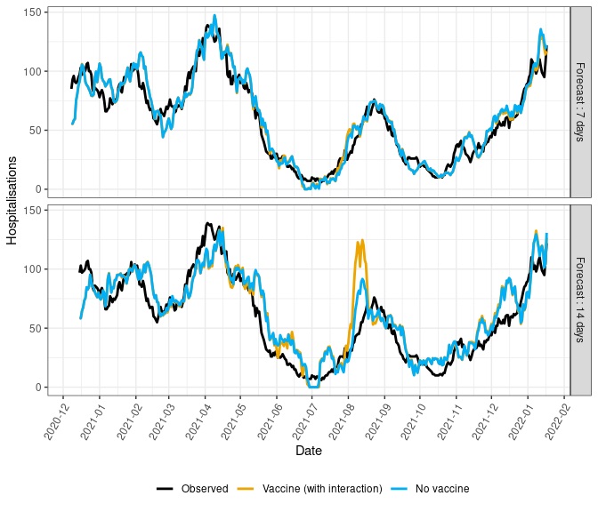

Figure 5.5: Comparions vaccine vs no vaccine data

## 5.3 Features importance

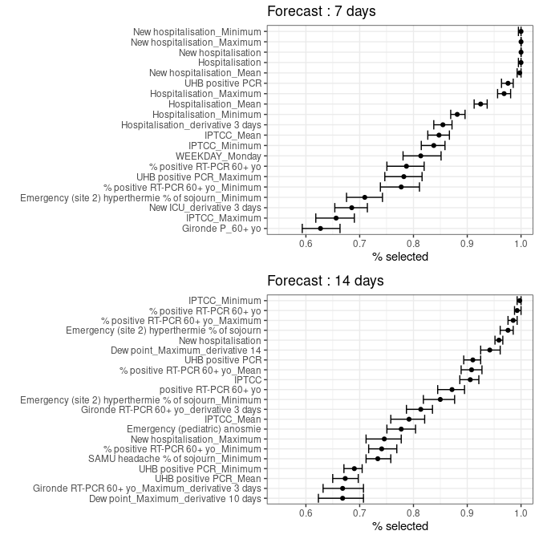

Figure 5.6: Features importance and bootstrapped confidence interval,
percentage of days selecting the features in linear elastic-net model.
Top 20 features are shown.

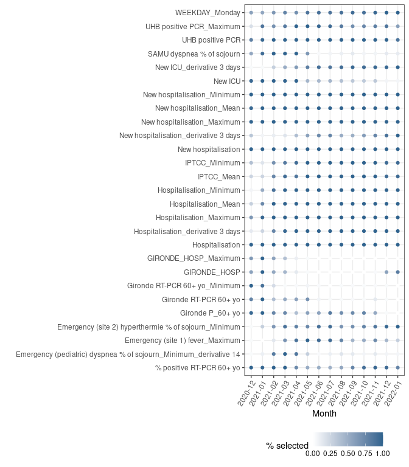

Figure 5.7: Feature importance evolution. Percentage of days selecting
each feature within each month. Only feature selected in every days of
at least one period are displayed. 7 days forecast.

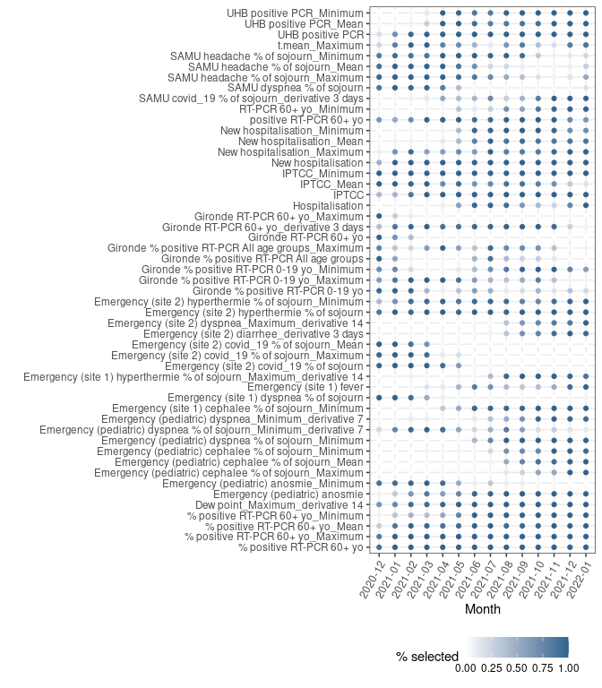

Figure 5.8: Feature importance evolution. Percentage of days selecting
each feature within each month. Only feature selected in every days of
at least one period are displayed. 14 days forecast

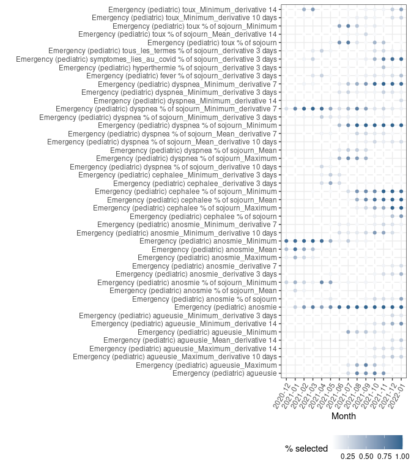

Figure 5.9: Feature importance evolution. Percentage of days selecting
each feature within each month. Only feature related to pediatric
emergency and selected in at least 20% days of at least one period are
displayed. 14 days forecast

